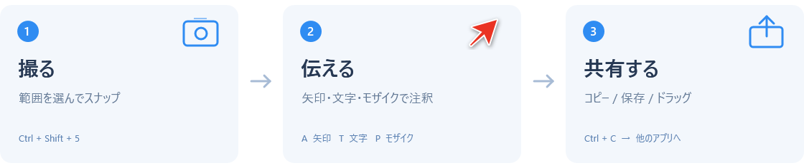
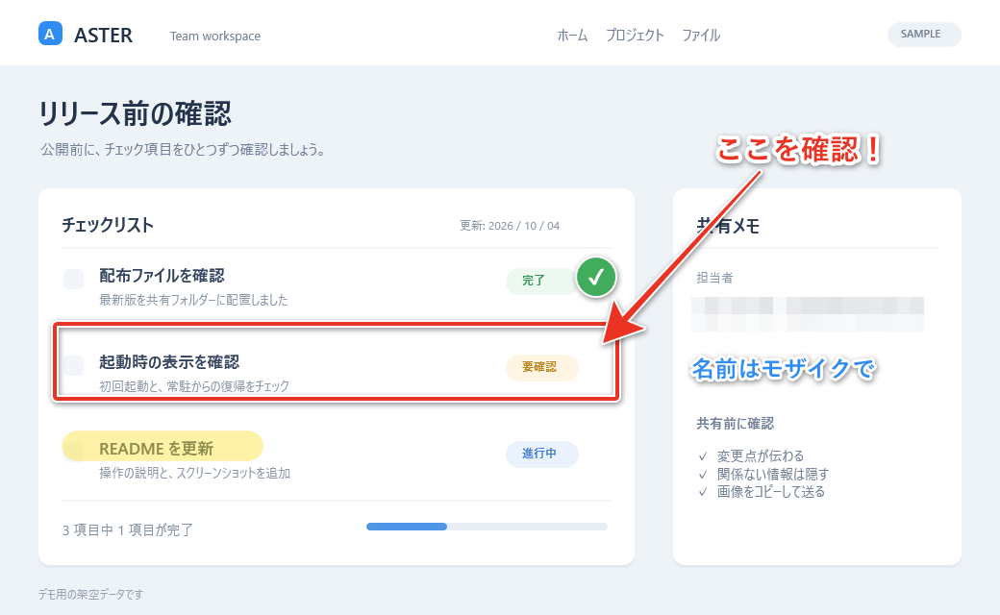

# WinSkitch

**画面を撮って、伝えたいところに書き込み、そのまま共有。**

Windows 用の画面キャプチャ・画面録画・画像注釈アプリです。矢印や文字で説明を加えたり、モザイクで一部を隠したりして、手順書・不具合報告・レビュー用の画像を作れます。操作の流れは MP4 動画でも記録できます。タスクトレイに常駐するので、必要なときにショートカットから呼び出せます。

配布向けの **C# / WPF 版** と、移植元の **Python / Tkinter 版** を管理しています。WPF 版はランタイムを同梱した単体 EXE にでき、受け取った人は Python や .NET をインストールせずに使えます。


*Windows 版の実際の画面部品を描画した使用例です。編集対象は説明用に作成したサンプル画像です。*

[ダウンロード](https://github.com/1000ri-jp/win_skitch/releases/latest) · [使い始める](#使い始める) · [使い方](#基本の使い方) · [常駐・自動起動](#常駐と自動起動) · [ビルド・配布](#開発と配布) · [Python 版](python/README.md)

## できること

| 用途 | 機能 |
| --- | --- |
| 撮る | 範囲選択、カーソルのあるモニター全体、5 秒後の範囲選択、前回と同じ範囲 |
| 動画で撮る（WPF 版） | 範囲・モニターの画面録画、MP4 保存、録画時間の表示・停止 |
| 説明する | 矢印、テキスト、四角形、角丸四角形、楕円、直線、ペン、蛍光ペン |
| 目印をつける | チェック、NG、質問、注意、スター、ハートのスタンプ |
| 一部を隠す | モザイク、ぼかし |
| 整える | 切り抜き、白い余白の追加、注釈の選択・移動・削除、元に戻す・やり直し |
| 取り込む | 画像ファイルを開く、ドラッグ＆ドロップ、クリップボードから貼り付け |
| 共有する | PNG / JPEG 保存、画像のコピー、PNG ファイルとして他のアプリへドラッグ |
| 保存先を見つける（WPF 版） | 画像・動画の保存履歴から、ファイルや保存フォルダーを開く |
| すぐ呼び出す | トレイ常駐、グローバルホットキー、Windows ログイン時の自動起動 |



## 使い始める

### GitHub からダウンロード

[Releases](https://github.com/1000ri-jp/win_skitch/releases/latest) から、お使いの PC に合った ZIP をダウンロードして展開してください。

| 対象 PC | v1.1.0 のダウンロード |
| --- | --- |
| 通常の x64 PC（Intel / AMD） | [WinSkitch-v1.1.0-win-x64.zip](https://github.com/1000ri-jp/win_skitch/releases/download/v1.1.0/WinSkitch-v1.1.0-win-x64.zip) |
| ARM64 PC | [WinSkitch-v1.1.0-win-arm64.zip](https://github.com/1000ri-jp/win_skitch/releases/download/v1.1.0/WinSkitch-v1.1.0-win-arm64.zip) |

ZIP には `WinSkitch.exe` と使い方の `README.txt` が入っています。展開した EXE をダブルクリックすれば起動できます。ARM64 版はクロスビルドしており、実機での動作確認は未実施です。配布ファイルの SHA-256 は Release の `SHA256SUMS.txt` で確認できます。

v1.1.0 では画面録画と保存履歴を追加しました。詳しくは[リリースノート](docs/releases/v1.1.0.md)を参照してください。更新するときは、起動中の WinSkitch をトレイの「終了」で閉じてから EXE を置き換えます。

### WinSkitch.exe を受け取った場合

1. `WinSkitch.exe` を、使い続けるフォルダーに保存します。
2. EXE をダブルクリックして起動します。Python・.NET ランタイムの事前インストールは不要です。
3. **`Ctrl + Shift + 5`** を押し、撮りたい範囲をドラッグします。
4. 左のツールで注釈を加え、上部の「コピー」または「保存」で書き出します。

通常の x64 PC 用と ARM64 PC 用の EXE は別々に作成します。配布時は相手の PC に合ったものを渡してください。

### ソースから使う場合

Windows と **.NET 10 SDK** を用意して、リポジトリを取得します。

```powershell
git clone https://github.com/1000ri-jp/win_skitch.git
cd win_skitch
.\windows\start.bat
```

起動スクリプトは、配布 EXE があればそれを使い、なければ WPF 版をビルドして起動します。EXE・SDK・ビルド結果は Git に含まれません。配布用 EXE を作る手順は[開発と配布](#開発と配布)にあります。

## 基本の使い方

### 1. 画像を用意する

- **範囲を撮る:** 「スナップ」ボタン、または `Ctrl + Shift + 5`。ドラッグで範囲を決め、`Esc` でキャンセルできます。
- **モニター全体を撮る:** `Ctrl + Shift + 6`。カーソルのあるモニター 1 台が対象です。
- **時間を置いて撮る:** 「スナップ」メニュー →「タイマースナップ（5秒後）」。カウントダウン後に範囲を選びます。
- **同じ場所を撮り直す:** 「スナップ」メニュー →「前回の範囲でスナップ」。前回の範囲はアプリの起動中に保持します。
- **既存の画像を使う:** 「開く」または `Ctrl + O`、ファイルをウィンドウへドロップ、画像を `Ctrl + V` で貼り付け。

### 2. 注釈を加える

左のツールを選び、画像上でドラッグします。色はパレット、線の太さ・文字の大きさはその下の 3 段階で変更できます。

| ツール | 使い方 |
| --- | --- |
| 矢印 | 始点から終点へドラッグし、説明したい場所を指します。 |
| テキスト | 画像上をクリックして入力。`Enter` で確定、`Shift + Enter` で改行します。 |
| 図形 | 四角形・角丸四角形・楕円・直線で、見てほしい範囲を示します。 |
| ペン・蛍光ペン | 自由に線を引いたり、文字や領域を強調したりします。 |
| モザイク・ぼかし | ドラッグした範囲に効果をかけます。 |
| スタンプ | クリックしてチェックや注意マークを置きます。 |
| 切り抜き | ハンドルで範囲を調整し、`Enter` で確定。画像の外側へ広げると白い余白を追加できます。 |

図形・ペン・モザイク・スタンプは、ツールを右クリックすると種類を変更できます。描画中に `Shift` を押すと、矢印・直線は 45 度単位、図形の範囲は縦横比 1:1 に揃います。既存の注釈はクリックして選択し、ドラッグで移動、`Delete` で削除できます。テキストを再編集するにはダブルクリックします。

### 3. 保存・共有する

- **コピー:** 「コピー」または `Ctrl + C`。メールやチャット、資料へ画像として貼り付けます。
- **保存:** 「保存」または `Ctrl + S`。PNG / JPEG に書き出します。別の名前で保存する場合は `Ctrl + Shift + S`。
- **ドラッグ:** 下部の「ここをドラッグして書き出し」から、ファイルを受け付ける他のアプリへドラッグします。

保存・コピー・ドラッグ書き出しでは、注釈を画像に合成します。透過部分は白い背景になります。保存した画像から注釈だけを再編集することはできないので、編集を続ける場合はアプリを開いたままにしてください。



*書き出し例。編集画面のツールバーなどは含まれず、注釈を加えた画像だけを共有できます。*

### 画面を動画で撮る（WPF 版）

1. 上部の「● 録画」、または `Ctrl + Shift + 7` で範囲録画を開始します。モニター全体の録画は隣の `▾` または「動画」メニュー →「モニター全体を録画…」を選び、実行時にカーソルのあるモニター 1 台を対象にします。
2. MP4 の保存先を選び、範囲録画の場合はドラッグで録画範囲を決めます。3 秒のカウントダウン後に録画が始まります。範囲選択・カウントダウン中の `Esc` や保存ダイアログのキャンセルで開始を取り消せます。
3. 録画中は赤い表示の操作ウィンドウに経過時間が表示されます。「停止して保存」、`Ctrl + Shift + 7`、またはトレイの録画停止で終了すると、指定した MP4 が保存されます。

動画は Windows 標準の Media Foundation を使い、マウスカーソルを含む画面を H.264 / MP4、15 fps で保存します。音声は録音しません。選択範囲のサイズが奇数の場合は、動画の右端・下端に最大 1 ピクセルの黒い余白を加えます。動画は外部のプレーヤーで再生でき、WinSkitch 内では動画の注釈編集は行えません。

保存先のファイルが他のアプリで使用中などの場合、完成した動画を一時ファイルとして残し、エラーにその場所を表示します。表示された MP4 を開くか、別の場所へ移して回収できます。

### 保存したファイルを履歴から開く（WPF 版）

上部の「履歴」または「ファイル」メニュー →「保存履歴…」を開くと、保存した PNG / JPEG 画像と MP4 動画を新しい順に最大 20 件表示します。履歴はアプリを再起動しても残ります。

ファイルを選んで「保存先を開く」を押すと、エクスプローラーでそのファイルを選択します。移動・削除済みのファイルは、元の保存フォルダーが残っていればフォルダーを開けます。「ファイルを開く」では Windows の既定の画像アプリや動画プレーヤーを使います。

## 常駐と自動起動

ウィンドウの **× はトレイへの格納**です。閉じたあとも `Ctrl + Shift + 5` / `6` でキャプチャ、`Ctrl + Shift + 7` で録画を開始・停止できます。編集画面を再表示するにはトレイアイコンをダブルクリックするか、右クリック →「ウィンドウを表示」を選びます。完全に終了するにはトレイの「終了」を選んでください。

毎回ログイン時から使うには、**「設定」→「Windowsログイン時に起動」**をオンにします。トレイの右クリックメニューからも設定でき、管理者権限は不要です。現在のユーザーだけに設定し、次回の Windows ログインからは編集画面を出さずにトレイで待機します。同じ項目をオフにすると自動起動を解除できます。

自動起動は現在の EXE の保存場所を登録します。EXE を移動する場合は、常駐中の WinSkitch をトレイの「終了」で終了してから、移動先の EXE を起動し、設定をオンにし直してください。常駐中に別の場所の EXE を起動しても、既存の編集画面を開きます。

手動でトレイだけに起動する場合:

```powershell
.\WinSkitch.exe --tray
# リポジトリ内の起動スクリプトを使う場合:
.\windows\start.bat -Tray
```

## ショートカット

| キー | 操作 |
| --- | --- |
| **Ctrl + Shift + 5** | 範囲キャプチャ（他のアプリを使っているときも有効） |
| **Ctrl + Shift + 6** | カーソルのあるモニターをキャプチャ（他のアプリを使っているときも有効） |
| **Ctrl + Shift + 7** | 範囲録画を開始 / 録画中の動画を停止（WPF 版、他のアプリを使っているときも有効） |
| Ctrl + O | 画像を開く |
| Ctrl + S / Ctrl + Shift + S | 保存 / 名前を付けて保存 |
| Ctrl + C / Ctrl + V | 画像をコピー / 貼り付け |
| Ctrl + Z / Ctrl + Y | 元に戻す / やり直し |
| A / T / R | 矢印 / テキスト / 図形 |
| M / H / P | ペン / 蛍光ペン / モザイク |
| S / C | スタンプ / 切り抜き |
| Delete | 選択した注釈を削除 |
| 矢印キー / Shift + 矢印キー | 選択した注釈を 1 / 10 ピクセル移動 |
| Enter / Shift + Enter | テキストの確定 / 改行 |
| Enter / Esc | 切り抜きの確定 / キャンセル |

ツール切り替えのキーはテキスト入力中には働きません。グローバルホットキーを他のアプリが使っている場合は、画面のボタンやトレイメニューからキャプチャしてください。

## 開発と配布

### Windows 版（C# / WPF）

必要な環境は **Windows + .NET 10 SDK** です。以下はリポジトリのルートで実行します。

```powershell
# Release ビルド
.\windows\build.ps1

# 動作検証
.\windows\WinSkitch.Tests\run.ps1

# x64 向けの単体 EXE を作成
.\windows\publish.ps1

# ARM64 向けの単体 EXE を作成
.\windows\publish.ps1 -Runtime win-arm64
```

配布するファイル:

| 対象 PC | ファイル |
| --- | --- |
| x64 | `artifacts\win-x64\WinSkitch.exe` |
| ARM64 | `artifacts\win-arm64\WinSkitch.exe` |

`publish.ps1` は .NET ランタイムを同梱し、単体 EXE 内で圧縮します。受け取る人にはこの EXE を渡せば使えます。初回起動時に必要な DLL が一時フォルダーに展開されます。

GitHub Release 用の ZIP と SHA-256 一覧を作る場合は、通常起動に使う EXE とは別のリリース用フォルダーへ発行します。

```powershell
.\windows\publish.ps1 -Runtime win-x64 -OutputDirectory artifacts/releases/v1.1.0/win-x64
.\windows\publish.ps1 -Runtime win-arm64 -OutputDirectory artifacts/releases/v1.1.0/win-arm64
.\windows\package-release.ps1 -Version 1.1.0
```

配布用ファイルは `artifacts\releases\v1.1.0\assets\` に生成します。詳しい手順は [Windows 版 README](windows/README.md#github-release-用のパッケージ)を参照してください。

テストは合成画像を使い、注釈、編集履歴、切り抜き、保存、DPI、WPF の描画、起動引数、常駐プロセス間の連携などを検証します。動画は合成フレームから MP4 を作成し、Windows のデコーダーで画面サイズ・時間・色の変化を確認します。保存履歴は専用のテストフォルダーで再読み込み・破損データ・保存失敗を確認します。ユーザーの画面・クリップボード・自動起動設定は変更しません。詳細は [Windows 版 README](windows/README.md) を参照してください。

### Python 版（Tkinter）

移植元を動かす場合は、Windows と tkinter を含む Python 3 を用意します。

```powershell
python -m venv .\python\.venv
.\python\.venv\Scripts\python.exe -m pip install -r .\python\requirements.txt
.\python\start.bat
```

依存パッケージは Pillow、pystray、tkinterdnd2 です。詳細は [Python 版 README](python/README.md) を参照してください。画面録画・自動起動の設定機能やビルド手順は Windows 版の説明です。

## よくある質問

**× を押しても終了しないのはなぜ？**

トレイに常駐するためです。終了はトレイメニューの「終了」から行います。アイコンが見つからない場合は、通知領域の隠れているアイコンも確認してください。

**「全画面」は複数のモニターをまとめて撮る？**

カーソルのあるモニター 1 台を撮ります。必要なモニターにカーソルを移動してから実行してください。

**自動起動しなくなった。**

常駐中の WinSkitch をトレイの「終了」で終了し、移動・名前変更後の EXE を起動して「Windowsログイン時に起動」をオンにし直してください。

**ビルド用 PowerShell スクリプトが実行できない。**

実行ポリシーで止められた場合は、確認したスクリプトをそのプロセスだけ許可して実行できます。例: `powershell -NoProfile -ExecutionPolicy Bypass -File .\windows\publish.ps1`。

**配布 EXE に Windows の警告が出る。**

現在のビルドはコード署名を行いません。未署名 EXE に対する警告は Windows の設定によって表示されます。

**保存した PNG の注釈を動かせる？**

書き出し時に 1 枚の画像へ合成するため、注釈だけの再編集はできません。編集可能なプロジェクト形式・編集状態の自動保存はありません。新しい画像を開く・キャプチャする前や、アプリを終了する前に、必要な画像を保存してください。

## 対応形式・制約

- 読み込み: PNG / JPEG / BMP / GIF / TIFF など、Windows / WPF の画像デコーダーに対応する形式。WebP は対応する Windows WIC コーデックが必要です。
- 書き出し: PNG / JPEG。コピーとドラッグ書き出しにも注釈を合成します。
- 動画書き出し（WPF 版）: H.264 / MP4、15 fps、音声なし。Windows の Media Foundation と H.264 エンコーダーが必要です。
- モニターごとの DPI 設定を認識します。実機での異なる DPI の複数モニター環境は、追加検証が必要です。
- 保護された動画・コンテンツや Windows のセキュリティ画面は、通常のデスクトップキャプチャでは取得できません。

## ソース構成

```text
win_skitch/
├─ README.md                 プロジェクト紹介・使い方
├─ docs/
│  ├─ images/                README の画面例・図
│  └─ tools/                 画面例の再生成ツール
├─ windows/
│  ├─ WinSkitch/             C# / WPF アプリ
│  ├─ WinSkitch.Tests/       合成画像・起動処理のテスト
│  ├─ build.ps1             ビルド
│  ├─ publish.ps1           配布 EXE の作成
│  ├─ package-release.ps1   Release 用 ZIP・SHA-256 の作成
│  └─ start.bat / start.ps1  起動
└─ python/
   ├─ winskitch/             Python / Tkinter アプリ
   ├─ requirements.txt      Python 依存パッケージ
   └─ start.bat / run.pyw    起動
```

`artifacts/`（EXE・テスト画像）、`.tools/`（ローカル SDK・キャッシュ）、`.venv/`（Python 仮想環境）、`bin/`・`obj/` は Git 管理対象外です。

README の画像は[再生成ツール](docs/tools/ReadmeImages/README.md)で更新できます。
