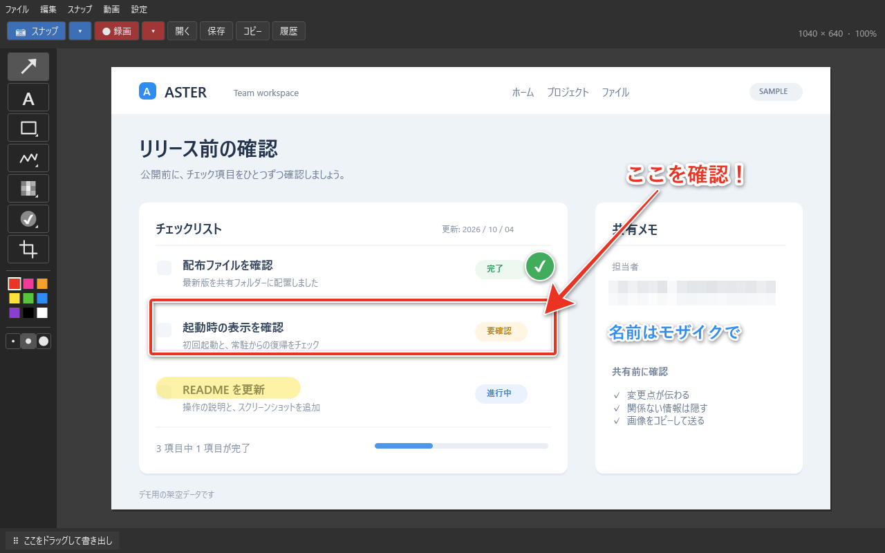

# WinSkitch Windows 版

Windows 用の画面キャプチャ・画面録画・画像注釈アプリです。C# / WPF と Win32 API で動作します。



合成したサンプル画像に注釈を加え、実際の WPF 編集画面を描画した例です。使い始める手順は[リポジトリの README](../README.md)も参照してください。

## 起動・配布

配布済みの `WinSkitch.exe` をダブルクリックしてください。Python と .NET ランタイムの事前インストールは不要です。ウィンドウの × ボタンはトレイに格納します。完全に終了するには、トレイのメニューから「終了」を選択します。

Windows へのログイン時から常駐させるには、アプリの「設定」→「Windowsログイン時に起動」をオンにしてください。トレイの右クリックメニューからも切り替えられます。管理者権限は不要で、現在のユーザーにだけ設定します。次回のログインからは編集画面を表示せず、トレイで待機します。`Ctrl + Shift + 5` ですぐに範囲キャプチャでき、トレイのダブルクリックで編集画面を開けます。自動起動を解除するには同じ項目をオフにします。

自動起動には EXE の現在の保存場所を登録します。EXE を移動する場合は、常駐中の WinSkitch をトレイの「終了」で終了してから、移動先の EXE を起動し、「Windowsログイン時に起動」をオンにし直してください。常駐中に別の場所の EXE を起動しても既存のプロセスが表示されるためです。手動でトレイのみ起動するには `WinSkitch.exe --tray` を使えます。通常のダブルクリックでは編集画面を開き、すでに常駐中ならその編集画面を表示します。

ソースから実行する場合は Windows と **.NET 10 SDK** が必要です。リポジトリのルートから `windows\start.bat` を実行してください。ルートにある `artifacts\win-x64\` と `artifacts\win-x64-updated\` の新しい方の EXE を起動し、どちらもなければ WPF 版をビルドして起動します。`windows\start.bat -Tray` でトレイのみ起動できます。ビルド用スクリプトはルートの `.tools\dotnet\dotnet.exe` を優先し、なければ PATH 上の `dotnet` を使用します。

以下のコマンドは、すべてリポジトリのルートで実行します。

PowerShell でのビルド:

```powershell
.\windows\build.ps1
```

他の人に渡す実行ファイルの作成:

```powershell
.\windows\publish.ps1
# ARM64 の Windows 用:
.\windows\publish.ps1 -Runtime win-arm64
```

通常の PC には `artifacts\win-x64\WinSkitch.exe`、ARM64 用には `artifacts\win-arm64\WinSkitch.exe` を渡します。ランタイムを同梱し、単体 EXE 内で圧縮しています。初回起動時に必要なネイティブ DLL がユーザーの一時フォルダーへ展開されます。未署名の実行ファイルは、Windows の設定によって警告が表示される場合があります。

### GitHub Release 用のパッケージ

リリース用の EXE は通常の起動に使うフォルダーと分けて発行します。以下は v1.1.0 の例です。

```powershell
.\windows\WinSkitch.Tests\run.ps1
.\windows\publish.ps1 -Runtime win-x64 -OutputDirectory artifacts/releases/v1.1.0/win-x64
.\windows\publish.ps1 -Runtime win-arm64 -OutputDirectory artifacts/releases/v1.1.0/win-arm64
.\windows\package-release.ps1 -Version 1.1.0
```

`-OutputDirectory` の相対パスはリポジトリのルートから解決します。`package-release.ps1` は、上記の両アーキテクチャの EXE を使って次のファイルを `artifacts\releases\v1.1.0\assets\` に作成します。ビルドや GitHub への公開は行いません。バージョンを省略するとアプリのプロジェクトファイルにある `Version` を使用します。

- `WinSkitch-v1.1.0-win-x64.zip`
- `WinSkitch-v1.1.0-win-arm64.zip`
- `SHA256SUMS.txt`

各 ZIP には `WinSkitch.exe` と日本語の `README.txt` を同梱します。Release には ZIP 2 件と `SHA256SUMS.txt` を添付し、[v1.1.0 のリリースノート](../docs/releases/v1.1.0.md)を掲載します。ARM64 版はクロスビルドで、実機の動作確認は未実施です。

## テスト

```powershell
.\windows\WinSkitch.Tests\run.ps1
```

追加のテストパッケージは不要です。合成画像を使い、注釈の描画・選択、効果の重なり順、編集履歴、切り抜き、DPI、透過、PNG / JPEG 保存、デスクトップ座標の変換、テキスト編集と WPF の画面描画を検証します。動画は合成フレームから MP4 を作成し、Media Foundation のデコーダーで解像度・フレーム数・時間・色の変化・上下の向きを確認します。奇数サイズの余白追加、中止時の一時ファイル削除、既存ファイルの保護、保存先が使用中の場合の完成動画の保全、録画操作パネルの描画も確認します。保存履歴は専用のテストフォルダーで、再起動後の復元、重複と件数制限、破損データ、保存に失敗した場合の既存データ保全、削除済みファイルを含む画面の表示と操作状態を確認します。起動引数と自動起動コマンドの引用符・パス検証も含みます。比較用 PNG と MP4 は `artifacts\qa\` に出力します。テストはユーザーのクリップボードや実際の画面を読み書きせず、自動起動の登録も変更しません。履歴のテストでは実際のユーザー設定を変更せず、エクスプローラーや動画プレーヤーも起動しません。

配布 EXE の起動確認には `--smoke-test <結果ファイルのパス>` を使えます。`--tray` と同じ起動経路でウィンドウが非表示のままであることを確認し、リソース・トレイ・ホットキーを初期化して終了し、結果をファイルへ保存します。画面キャプチャ・クリップボード操作・自動起動登録の変更は行いません。

## 機能

- 範囲選択、カーソルのあるモニター全体、5 秒後の範囲選択、前回の範囲のキャプチャ。「全画面スナップ」はカーソルのある 1 台のモニターを対象にします。
- 範囲選択・モニター全体の画面録画、MP4 保存、経過時間表示と停止。
- 矢印、テキスト、四角形・角丸四角形・楕円・直線、ペン・蛍光ペン。
- モザイク・ぼかし、スタンプ、切り抜き、注釈の選択・移動・削除。
- 画像を開く、ドラッグ＆ドロップ、クリップボードからの貼り付け、PNG / JPEG 保存、画像のコピー、ファイルとしてのドラッグ書き出し。
- 画像・動画の保存履歴、保存先フォルダーの表示、既定のアプリで保存したファイルを開く。
- 元に戻す・やり直し、色とサイズの選択、トレイ常駐、グローバルホットキー。

## 画面録画

上部の「● 録画」、`Ctrl + Shift + 7`、または「動画」メニュー →「範囲を録画…」で、画面の一部を動画として撮れます。保存する MP4 の場所を選び、ドラッグで範囲を決めると、3 秒のカウントダウン後に録画を開始します。`Esc` で範囲選択やカウントダウンを中止できます。

上部の録画ボタンに隣接する `▾` または「動画」メニュー →「モニター全体を録画…」で、カーソルのあるモニター 1 台を録画します。対象は保存ダイアログを開く前のカーソル位置で決まります。トレイの右クリックメニューからも録画を開始できます。

録画中は赤い「● 録画中」と経過時間を操作パネルに表示します。「■ 停止して保存」、`Ctrl + Shift + 7`、メニューやトレイの録画停止を使うと、動画を確定して保存します。保存完了まで停止ボタンは「保存中…」になります。操作パネルの × も停止して保存します。

動画はマウスカーソルを含む画面を Windows 標準の Media Foundation で H.264 / MP4、15 fps、音声なしで保存します。FFmpeg などの追加インストールは不要です。選択範囲が奇数サイズの場合は、右端や下端に最大 1 ピクセルの黒い余白を加えて偶数サイズにします。確定前の動画は保存先と同じフォルダーの一時ファイルへ書き込み、録画・保存が成功してから保存先を置き換えます。動画の再生・注釈編集は外部アプリを使用してください。

保存先が他のアプリで使用中などの場合は、完成した動画を `.winskitch-recording-*.mp4` の一時ファイルに残します。エラーに表示された場所から、その MP4 を別の場所へ移して回収できます。画面下部のエラー表示にマウスを置くと全文とファイルの場所を確認できます。「終了」時に保存が失敗した場合も、エラーを確認できるよう編集画面を表示したままにします。

## 保存履歴

上部の「履歴」または「ファイル」メニュー →「保存履歴…」から、保存した PNG / JPEG 画像と MP4 動画を確認できます。保存日時とファイルの場所を、新しい順に最大 20 件表示します。同じ場所へ保存し直したファイルは一番上へ移動します。履歴はアプリを再起動しても残ります。

ファイルを選んで「保存先を開く」を押すと、エクスプローラーで保存したファイルを選択します。ファイルが移動・削除済みでも元のフォルダーが存在すれば、そのフォルダーを開きます。「ファイルを開く」では Windows の既定の画像アプリや動画プレーヤーを使用します。

## ショートカット

| キー | 操作 |
| --- | --- |
| Ctrl + Shift + 5 | 範囲キャプチャ（他のアプリ操作中も有効） |
| Ctrl + Shift + 6 | カーソルのあるモニターをキャプチャ（他のアプリ操作中も有効） |
| Ctrl + Shift + 7 | 範囲録画を開始 / 録画中の動画を停止して保存（他のアプリ操作中も有効） |
| Ctrl + O | 画像を開く |
| Ctrl + S / Ctrl + Shift + S | 保存 / 名前を付けて保存 |
| Ctrl + C / Ctrl + V | 画像をコピー / 貼り付け |
| Ctrl + Z / Ctrl + Y | 元に戻す / やり直し |
| A / T / R | 矢印 / テキスト / 図形 |
| M / H / P | ペン / 蛍光ペン / モザイク |
| S / C | スタンプ / 切り抜き |
| Delete | 選択した注釈を削除 |
| Esc | 選択を解除 / 切り抜き・キャプチャをキャンセル（テキスト編集中は確定） |
| Enter | テキスト編集 / 切り抜きを確定 |
| Shift + Enter | テキスト編集で改行 |
| 矢印キー / Shift + 矢印キー | 選択した注釈を 1 / 10 ピクセル移動 |

描画中に Shift を押すと、矢印・直線は 45 度単位、四角形・楕円などの範囲は縦横比 1:1 に揃えます。ツールの右クリックで図形・ペン・モザイク・スタンプの種類を変更できます。切り抜きのハンドルを元画像より外側へ広げると、白い余白を追加できます。

テキスト入力中はツール切り替えのショートカットを無効にします。ホットキーを他のアプリが使用している場合は登録できないため、画面上のボタンまたはトレイメニューからキャプチャしてください。

## 構成・制約

WPF 版のソースは `windows/WinSkitch/`、テストは `windows/WinSkitch.Tests/` にあります。ビルド・配布・起動スクリプトと `NuGet.Config` も `windows/` にまとめています。配布 EXE とテスト出力はルートの `artifacts/`、ローカルの .NET SDK はルートの `.tools/` を使用します。従来の Python 版は `python/` に保存しています（[Python 版 README](../python/README.md)）。

モニターごとの DPI 設定を認識します。保護された動画・コンテンツ、Windows のセキュリティ画面は通常のデスクトップキャプチャでは取得できません。画像の読み込みは Windows / WPF のデコーダーに従い、WebP は対応する Windows WIC コーデックが必要です。

録画には Windows の Media Foundation と H.264 エンコーダーが必要です。これらが利用できない環境では、録画開始時にエラーを表示します。録画範囲は幅・高さそれぞれ 4096 ピクセル以内で、実際に保存できるサイズはその PC のエンコーダーの対応範囲に従います。音声や Web カメラは録音・撮影しません。

保存・コピー・ドラッグ書き出しでは注釈を画像に合成し、透明な部分は白い背景にします。PNG への保存でも透過は保持しません。注釈を後から編集するためのプロジェクト形式はありません。
